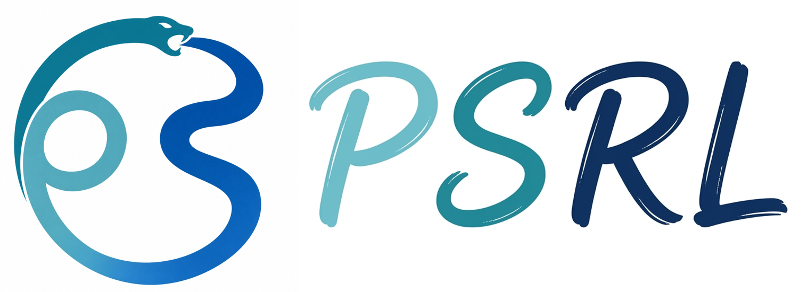
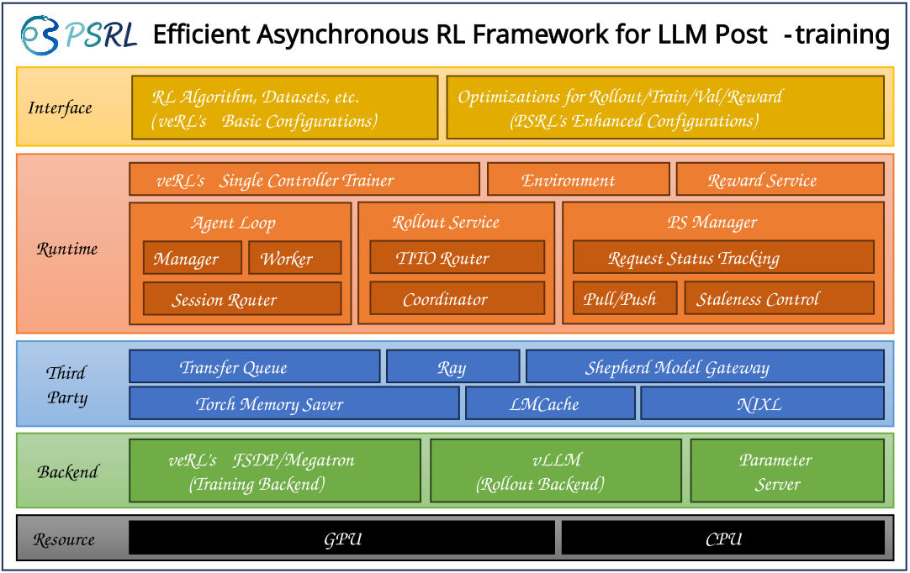

<div align="center">
  
</div>

<h3 align="center">
An Efficient Asynchronous RL Framework for LLM Post-Training
</h3>

<p align="center">
| <a href="https://psrl.readthedocs.io/en/latest/"><b>Documentation</b></a> |
<a href="https://arxiv.org/abs/2601.12784"><b>Paper</b></a> |
<a href="https://psrl.readthedocs.io/en/latest/tutorial/quickstart.html"><b>Quick Start</b></a> |
<a href="https://psrl.readthedocs.io/en/latest/examples/index.html"><b>Examples</b></a> |
<a href="https://psrl.readthedocs.io/en/latest/design/architecture.html"><b>Architecture</b></a> |
</p>

<p align="center">
<a href="https://psrl.readthedocs.io/en/latest/"></a>
<a href="https://arxiv.org/abs/2601.12784"></a>
<a href="https://github.com/volcengine/verl"></a>
<a href="./LICENSE"></a>
</p>

---

**PSRL** is an efficient asynchronous RL framework for LLM post-training, targeting the system bottlenecks that emerge in **agentic, dynamic, and long-tailed** RL workloads, achieving up to **2.68×** throughput improvement. It is developed by a joint team from **PKU & SJTU**.

## 📰 News

- **[2026/07/28]** 🎉 We open-source **PSRL**!
- **[2026/06/13]** 🏆 **StaleFlow**, the paper introducing the PSRL system, is accepted to **SIGMOD 2027**! Check out the [paper](https://arxiv.org/abs/2601.12784).
- **[2026/06/10]** 🔬 We release **ForeMoE**, which uses foreseeable rollout expert-routing information to optimize MoE RL load balancing. Check out the [paper](https://arxiv.org/abs/2606.11867).

## ✨ Overview

**PSRL** is a reinforcement learning (RL) framework for efficient large language model (LLM) post-training. It decouples rollout, reward, and training while coordinating them through a **Parameter Server**: generation and training progress asynchronously while model-version staleness remains explicitly bounded.

Built on [veRL](https://github.com/volcengine/verl), PSRL focuses on the system bottlenecks that emerge in **agentic, dynamic, and long-tailed** RL workloads: uneven rollout latency, version-aware weight management, multi-turn KV cache reuse, and elastic resource allocation across rollout, reward, and training models.

<div align="center">
  
  <p><em>Overall PSRL system architecture.</em></p>
</div>

### Why PSRL

- ⚡ **Async without sacrificing convergence**: trajectory-level version binding with a Reserve/Occupy/Consume protocol keeps staleness bounded while training and generation run concurrently.
- 🔌 **RDMA-native weight sync**: a CPU-side Parameter Server pushes/pulls weights via NIXL over UCX/RDMA (or local shared memory), avoiding collective-style synchronization barriers between train and gen clusters.
- 🧵 **Built for long-tailed rollout**: partial rollout, redundant rollout, intelligent routing, and load-balanced migration work together to minimize idle GPU time from uneven trajectory lengths.
- 🤖 **Agentic RL out of the box**: native environment loops plus SessionRouter/TITO let both integrated and black-box agents train through PSRL with minimal code changes.

## 🚀 Quick Start

### Prerequisites

| Requirement | Notes |
|---|---|
| OS | Ubuntu 22.04+ |
| GPU | NVIDIA GPU supported by the pinned PyTorch/CUDA stack |
| CUDA | 12.8-compatible driver/toolchain |
| Python | 3.12 |
| Rust / Cargo | Required to build SMG's Rust gateway and Python binding |
| Network | InfiniBand / RoCE recommended for multi-node RDMA weight transfer |

### Installation

#### Docker

```bash
docker build --progress=plain -f docker/Dockerfile -t psrl:latest .

docker run --rm --gpus all --ipc=host --shm-size=16g \
  --ulimit memlock=-1 --ulimit stack=67108864 \
  -v "$PWD:/home/psrl" \
  -it psrl:latest
```

For CPU-only development and smoke tests, build `docker/Dockerfile.cpu` and use
`psrl:cpu`. See the [Docker guide](docker/README.md) for prerequisites, reproducible
builds, and multi-node runtime settings.

#### From source

```bash
# Rust prerequisite installation
curl --proto '=https' --tlsv1.2 -sSf https://sh.rustup.rs | sh
source "$HOME/.cargo/env"

# Use conda to manage the environment
conda create -n psrl python=3.12
conda activate psrl

# Install core dependencies
# If you have an existing **editable** vLLM or veRL installation,
# you can pass in VLLM_PATH and VERL_PATH to `scripts/install_basic.sh`.
bash scripts/install_basic.sh

# Install performance components as needed
bash scripts/install_nixl.sh
bash scripts/install_megatron.sh
bash scripts/install_lmcache.sh

# Install PSRL
python -m pip install -e .
```

See the [Installation guide](https://psrl.readthedocs.io/en/latest/tutorial/installation.html) for prerequisites, verification steps, and details on each component.

### Run Your First Training Job

```bash
# 1. Start a Ray cluster from a hostfile (first line is the head node)
bash examples/ray/ray_start.sh ${PSRL_WORKSPACE}/hosts/16GPUs

# 2. Launch DAPO training (Qwen2.5-3B, FSDP backend, staleness=3 by default)
bash examples/dapo_trainer/qwen2.5_3b_fsdp.sh
```

> `staleness` controls the maximum version gap between generation and training: `staleness=0` is fully synchronous (generation blocks until training catches up), while `staleness>0` lets generation run ahead of training asynchronously to boost throughput.

For the full step-by-step walkthrough (data preparation, cluster layout, monitoring metrics), see the **[Quick Start guide](https://psrl.readthedocs.io/en/latest/tutorial/quickstart.html)**.

## 📚 Examples

Production-ready training recipes demonstrating PSRL's capabilities across different RL paradigms.

| Recipe | Task Domain | Reward Type | Backend | Script | Status |
|---|---|---|---|---|---|
| [DAPO](https://psrl.readthedocs.io/en/latest/examples/rlvr/dapo.html) | Math / Reasoning | Verifiable | FSDP / Megatron | [`examples/dapo_trainer/`](examples/dapo_trainer/) | ✅ Ready |
| [PPO](https://psrl.readthedocs.io/en/latest/examples/rlvr/ppo.html) | Math / Reasoning | Verifiable | FSDP / Megatron | [`examples/ppo_trainer/`](examples/ppo_trainer/) | ✅ Ready |
| [GRPO](https://psrl.readthedocs.io/en/latest/examples/rlvr/grpo.html) | Math / Reasoning | Verifiable | FSDP / Megatron | [`examples/grpo_trainer/`](examples/grpo_trainer/) | ✅ Ready |
| [ReTool](https://psrl.readthedocs.io/en/latest/examples/agentic_rl/retool/index.html) | Math + Code Interpreter | Verifiable | FSDP / Megatron | [`examples/retool/`](examples/retool/) | ✅ Ready |
| [SWE-agent](https://psrl.readthedocs.io/en/latest/examples/agentic_rl/swe/index.html) | Software Engineering | Test execution (F2P/P2P) | FSDP / Megatron | [`examples/mini_swe/`](examples/mini_swe/) | ✅ Ready |
| [LLM-as-a-Judge](https://psrl.readthedocs.io/en/latest/examples/generative_reward_model/llm_as_a_judge.html) | Open-ended | Judge LLM score | — | — | 🚧 TBD |
| [On-Policy Distillation](https://psrl.readthedocs.io/en/latest/examples/generative_reward_model/on_policy_distillation.html) | Open-ended | Teacher token-level supervision | — | — | 🚧 TBD |

## 📖 Documentation

- **Tutorial**: [Installation](https://psrl.readthedocs.io/en/latest/tutorial/installation.html) · [Quick Start](https://psrl.readthedocs.io/en/latest/tutorial/quickstart.html) · [Configuration](https://psrl.readthedocs.io/en/latest/tutorial/configuration.html) · [Performance Tuning](https://psrl.readthedocs.io/en/latest/tutorial/performance_tuning.html)
- **Examples**: [RLVR](https://psrl.readthedocs.io/en/latest/examples/rlvr/index.html) · [Agentic RL](https://psrl.readthedocs.io/en/latest/examples/agentic_rl/index.html) · [Generative Reward Model](https://psrl.readthedocs.io/en/latest/examples/generative_reward_model/index.html)
- **Designs & Features**: [Architecture](https://psrl.readthedocs.io/en/latest/design/architecture.html) · [Staleness Control](https://psrl.readthedocs.io/en/latest/design/staleness_control.html) · [Flexible Rollout](https://psrl.readthedocs.io/en/latest/design/flexible_rollout.html) · [Parameter Server](https://psrl.readthedocs.io/en/latest/design/parameter_server.html) · [Router, SessionRouter & TITO](https://psrl.readthedocs.io/en/latest/design/router_tito.html) · [KV Cache Management](https://psrl.readthedocs.io/en/latest/design/kv_cache.html) · [Resource Elasticity](https://psrl.readthedocs.io/en/latest/design/resource_elasticity.html)

## 🤝 Contributing to PSRL

PSRL is open to everyone and welcomes all kinds of contributions! Please feel free to submit an Issue or PR — see [CONTRIBUTING.md](CONTRIBUTING.md) for the full developer setup guide. Before contributing, please use [pre-commit](https://pre-commit.com/#usage) to lint and format the codebase:

```bash
uv pip install pre-commit
pre-commit install

# run pre-commit to ensure code style consistency
pre-commit run --all-files --show-diff-on-failure --color=always

# run pre-commit on staged files only
pre-commit run
```

## 💬 Community

We use [GitHub Issues](https://github.com/psrl-project/psrl/issues) for bug reports, feature requests and general questions. We warmly welcome everyone to join in and help shape PSRL!

## 📮 Contact Us

For enterprises interested in adopting or deploying PSRL at scale, including technical consulting or partnership inquiries, please contact us at [lihaoyang@stu.pku.edu.cn](mailto:lihaoyang@stu.pku.edu.cn).

## 🙏 Acknowledgements

PSRL is built upon the foundations of [veRL](https://github.com/volcengine/verl). We also thank the following projects that PSRL integrates with or draws inspiration from: [vLLM](https://github.com/vllm-project/vllm), [Megatron-LM](https://github.com/NVIDIA/Megatron-LM), [TransferQueue](https://github.com/Ascend/TransferQueue), [LMCache](https://github.com/LMCache/LMCache), and [NIXL](https://github.com/ai-dynamo/nixl)/UCX for RDMA transport. We also appreciate all the pioneering and inspirable projects from the community, including but not limited to [OpenRLHF](https://github.com/OpenRLHF/OpenRLHF), [AReaL](https://github.com/areal-project/AReaL), [slime](https://github.com/THUDM/slime), and [NeMo-RL](https://github.com/NVIDIA/NeMo-RL).

## 📄 Citation

If you use PSRL in your research, please cite our paper:

```bibtex
@article{li2026staleflow,
  title={Unleashing Efficient Asynchronous RL Post-Training via Staleness-Constrained Rollout Coordination},
  author={Li, Haoyang and Lin, Sheng and Fu, Fangcheng and Zhou, Yuming and Ji, Xiaodong and Zhao, Yanfeng and Wang, Lefeng and Jiang, Jie and Cui, Bin},
  journal={arXiv preprint arXiv:2601.12784},
  year={2026}
}
```

## 📜 License

PSRL is licensed under the [Apache License 2.0](LICENSE).
